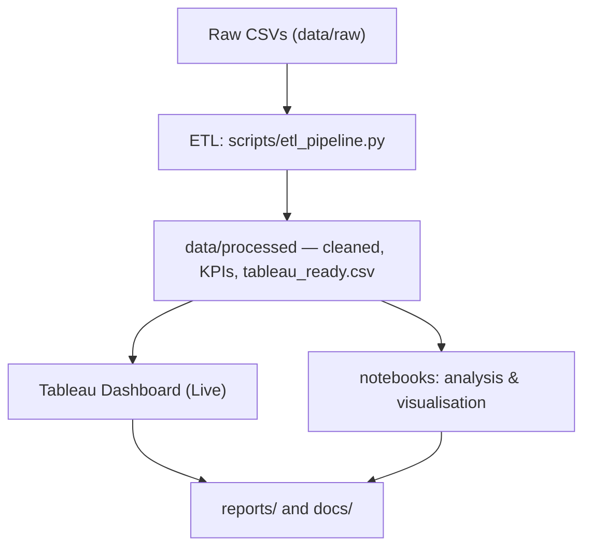

<p align="center">
    
</p>

Predicting and analysing customer churn from Olist marketplace data — extraction, cleaning, EDA, KPI generation, and Tableau-ready outputs.

<p align="center">
    
    
    
    
</p>

## ✨ Overview

- Goal: analyse Olist orders/customers to derive churn-related KPIs and build reproducible artifacts for reporting and dashboards.
- Pipeline: extraction → cleaning → EDA → statistical analysis → final load/prep for Tableau.

## 🧰 Tech Stack

- Languages & libs: Python, Pandas, NumPy, Scikit-learn
- Notebooks: Jupyter / JupyterLab
- Reporting: Tableau (prepared `tableau_ready.csv`)
- Orchestration: lightweight ETL in `scripts/etl_pipeline.py`

## 📂 Key files

- `requirements.txt` — Python dependencies
- `scripts/etl_pipeline.py` — ETL that transforms `data/raw/` → `data/processed/`
- `notebooks/` — stepwise notebooks `01_extraction.ipynb` → `05_final_load_prep.ipynb`
- `docs/data_dictionary.md` — field definitions and notes
- `data/processed/` — outputs including `customers_kpi.csv`, `monthly_kpi.csv`, `state_kpi.csv`, `tableau_ready.csv`
- `logs/` — pipeline logs for reproducibility and audit

## 📈 High-level workflow



**Live Tableau Dashboard:** [View dashboard](https://public.tableau.com/views/CustomerChurn_17769513030030/Retention)

## 🚀 Quick start

1. Create and activate a virtual environment (Python 3.10+):

```bash
python -m venv .venv
source .venv/bin/activate
```

2. Install dependencies:

```bash
pip install -r requirements.txt
```

3. Run the ETL to regenerate processed datasets (example with input/output):

```bash
python scripts/etl_pipeline.py --input data/raw/olist_orders_dataset.csv \
    --output data/processed/olist_orders_cleaned.csv
```

4. Explore analysis and visualizations in the notebooks:

```bash
jupyter lab notebooks/
```

## 🔁 Reproducibility & Notes

- Processed artifacts are written to `data/processed/` and are used for reporting and Tableau dashboards.
- The `logs/` folder documents each pipeline stage (extraction, cleaning, EDA, stats, final prep).

---


